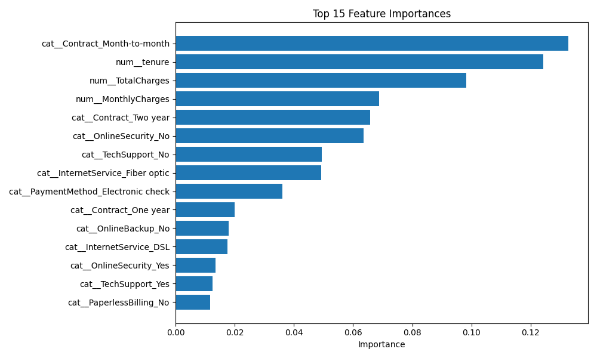
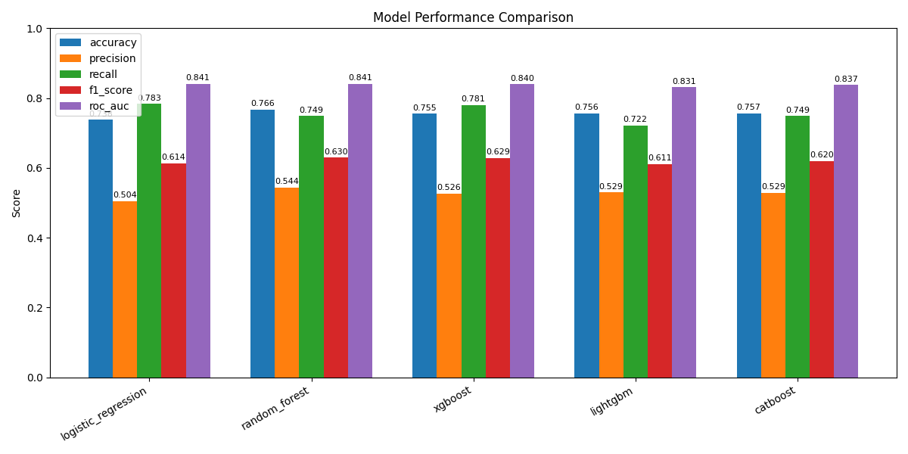

# 📊 Müşteri Kaybı (Churn) Tahmini & API Servisi

[](https://fastapi.tiangolo.com/)
[](https://streamlit.io/)
[](https://scikit-learn.org/)
[](https://www.python.org/)

## 🚀 Proje Genel Bakış

Kaggle üzerindeki **Telco Customer Churn** veri seti kullanılarak müşteri kaybı tahmini yapan bir makine öğrenmesi modeli ve bu modeli servis eden tam kapsamlı bir API uygulamasıdır. Sistem, ham verinin işlenmesinden başlayarak, 5 farklı gelişmiş algoritmanın yarıştırılması, şampiyon modelin bir API (FastAPI) arkasına alınması ve son kullanıcı için interaktif bir arayüz (Streamlit) sunulmasına kadar olan tüm aşamaları kapsar.

## ✨ Proje Kapsamı ve Temel Yetkinlikler

- End-to-end ML pipeline (EDA → Training → Evaluation → Deployment)
- **Kapsamlı Veri Ön İşleme:** Scikit-learn Pipeline yapısı ile veri sızıntısı (leakage) engellenmiş, tamamen ölçeklenebilir bir yapı kurulmuştur.
- **Gelişmiş Model Yarıştırma:** Logistic Regression, Random Forest, XGBoost, LightGBM ve CatBoost modelleri eğitilmiş, en iyi F1-skoruna sahip olan otomatik seçilmiştir.
- **Dinamik Sınıf Dengeleme:** Verideki azınlık sınıfı (Churn) için `scale_pos_weight` ve `class_weight` parametreleri otomatik hesaplanmıştır.
- **Modern Mimari:** **FastAPI** ile asenkron Backend ve **Streamlit** ile interaktif Frontend deneyimi sunulmaktadır.
- Feature importance analizi

## 🧠 Key Insights (EDA)

- **Month-to-month sözleşmeler** en yüksek churn oranına sahiptir
- **Düşük tenure (yeni müşteriler)** daha yüksek churn riski taşır
- **Yüksek MonthlyCharges** churn riskini artırmaktadır
- **Electronic check ödeme yöntemi** kullanan müşteriler daha risklidir
- **OnlineSecurity ve TechSupport eksikliği** churn riskini artırmaktadır

## 📈 Model Performansı

Bu çalışma kapsamında beş farklı model denenmiş ve aşağıdaki metrikler (Accuracy, Precision, Recall, F1-score, ROC-AUC) takip edilmiştir. Model yarıştırması sonucunda en yüksek performansı **Random Forest** göstermiştir:

| Model               | Accuracy | Precision | Recall | F1-Score   | ROC-AUC |
| ------------------- | -------- | --------- | ------ | ---------- | ------- |
| **Random Forest**   | 0.7665   | 0.5437    | 0.7487 | **0.6299** | 0.8414  |
| XGBoost             | 0.7551   | 0.5261    | 0.7807 | 0.6286     | 0.8400  |
| CatBoost            | 0.7566   | 0.5293    | 0.7487 | 0.6202     | 0.8372  |
| LightGBM            | 0.7559   | 0.5294    | 0.7219 | 0.6109     | 0.8314  |
| Logistic Regression | 0.7381   | 0.5043    | 0.7834 | 0.6136     | 0.8413  |

Random Forest modeli, en yüksek **F1-score** ve dengeli **precision–recall** performansı nedeniyle seçilmiştir.

## 📌 Real-World Perspective

Churn problemlerinde **recall**, accuracy’den daha kritiktir.

👉 Çünkü churn müşterisini kaçırmak, yanlış alarmdan daha maliyetlidir.

Bu nedenle model değerlendirmesi **F1-score ve recall odaklı** yapılmıştır.

## 🔍 Feature Importance

En önemli faktörler:

- Contract (özellikle Month-to-month)
- Tenure
- MonthlyCharges / TotalCharges
- OnlineSecurity & TechSupport
- PaymentMethod (Electronic check)

## 📊 Visuals

### Feature Importance



### Model Comparison



## 📂 Klasör Yapısı

```text
churn_challenge/
├── data/                      # Ham veri seti (Telco Customer Churn)
│   └── WA_Fn-UseC_-Telco-Customer-Churn.csv
│
├── models/                    # Eğitilmiş model ve metrikler
│   ├── churn_pipeline.pkl
│   ├── metrics.json
│   └── experiments/           # Model denemeleri / çıktılar
│
├── reports/                   # Analiz çıktıları
│   └── figures/               # Grafikler (EDA, model comparison vb.)
│
├── notebooks/                 # Keşifsel analiz (EDA)
│   └── eda_churn_analysis.ipynb
│
├── src/                       # Ana uygulama kodları
│   ├── train.py               # Model eğitimi
│   ├── train_randomized.py    # RandomizedSearch denemeleri
│   ├── evaluate.py            # Model değerlendirme
│   ├── predict.py             # Tahmin fonksiyonları
│   ├── app.py                 # FastAPI backend
│   └── frontend.py            # Streamlit arayüz
│
├── requirements.txt           # Python bağımlılıkları
├── README.md                  # Proje açıklaması
└── REPORT.md                  # Detaylı teknik rapor
```

## 💾 Veri Seti

Kullanılan veri seti: Telco Customer Churn

Dosya adı: WA*Fn-UseC*-Telco-Customer-Churn.csv

Kurulum sonrası bu dosyayı data/ klasörü altına yerleştirmeniz gerekmektedir.

## 🛠️ Kurulum ve Çalıştırma

### 1. Sanal Ortam Hazırlığı:

```bash
  python -m venv venv
  .\venv\Scripts\activate  # Windows için
  # source venv/bin/activate # macOS/Linux için
  pip install -r requirements.txt
```

### 2. Model Eğitimi (Opsiyonel)

Aşağıdaki komut modelleri yarıştırır, en iyisini seçer ve 'models/churn_pipeline.pkl' ile 'models/metrics.json' dosyalarını oluşturur:

```bash
  python src/train.py
```

### 3. API'yi Çalıştırma

```bash
  uvicorn src.app:app --reload
```

API çalıştıktan sonra servislere şu adreslerden ulaşabilirsiniz:

Swagger UI: http://127.0.0.1:8000/docs (Tüm parametreleri test etmek için)

Health Check: http://127.0.0.1:8000/health

### 4. Kullanıcı Arayüzünü Açma (Frontend)

Yeni bir terminal sekmesi açarak Streamlit uygulamasını başlatın:

```bash
  streamlit run src/frontend.py
```

## 🔌 API Kullanımı (Predict Endpoint)

Endpoint: POST /predict

### Örnek Request Body (JSON):

```json
{
  "gender": "Female",
  "SeniorCitizen": 0,
  "Partner": "Yes",
  "Dependents": "No",
  "tenure": 12,
  "PhoneService": "Yes",
  "MultipleLines": "No",
  "InternetService": "Fiber optic",
  "OnlineSecurity": "No",
  "OnlineBackup": "Yes",
  "DeviceProtection": "No",
  "TechSupport": "No",
  "StreamingTV": "Yes",
  "StreamingMovies": "Yes",
  "Contract": "Month-to-month",
  "PaperlessBilling": "Yes",
  "PaymentMethod": "Electronic check",
  "MonthlyCharges": 89.5,
  "TotalCharges": 1050.2
}
```

### Örnek Response (JSON):

```json
{
  "prediction": 1,
  "prediction_label": "Churn",
  "probability": 0.8123
}
```

## 🎯 Business Impact

- Riskli müşterilerin erken tespitini sağlar
- Müşteri kaybını azaltmaya yönelik aksiyonların zamanında alınmasını sağlar
- Kampanya ve müşteri tutma stratejilerini daha hedefli hale getirir
- Fiyatlandırma ve sözleşme stratejilerinin optimize edilmesine yardımcı olur

## 📝 Geliştirme Notları

- Veri setindeki TotalCharges sütunu numerik tipe çevrilmiştir.

- Gereksiz gürültüyü önlemek için customerID model girdisinden çıkarılmıştır.

- Kategorik değişkenler için OneHotEncoder, sayısal değişkenler için StandardScaler kullanılmıştır.

- Eğitim ve test verisi ayrılırken sınıf dengesizliğini korumak için train_test_split(..., stratify=y) uygulanmıştır.

- Model performansını iyileştirmek amacıyla RandomizedSearchCV ile hyperparameter tuning uygulanmış ve farklı parametre kombinasyonları değerlendirilmiştir. Ancak tuning sonrası elde edilen metriklerin baseline modele kıyasla anlamlı bir iyileşme sağlamadığı gözlemlenmiştir. Bu nedenle, daha düşük karmaşıklığa sahip ve daha stabil sonuçlar üreten model API servisinde tercih edilmiştir.
